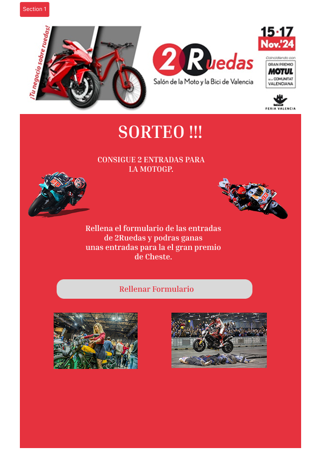

# 🎪 Proyecto de Prácticas en la Feria de Valencia

¡Bienvenido al repositorio! 👋  
En este repositorio tengo los templates de los mails y la app desarrollada en Python que se encarga de enviarlos (base de datos incluida sin datos).

## 📋 Índice
1. [¿Qué contiene este repositorio?](#-qué-contiene-este-repositorio)
2. [Tecnologías Utilizadas](#️-qué-tecnologias-uso)
3. [Estructura del Proyecto](#-índice-del-repositorio)
4. [Configuración del Entorno](#️-configuración-del-entorno)
5. [Componentes Principales](#-componentes-principales)
6. [Guía de Uso](#-como-levantar-el-proyecto)
7. [Supuestos Prácticos](#-supuesto-1-template-de-la-newsletter-del-salón-del-manga)

## 📬 ¿Qué contiene este repositorio?

- 📨 **Templates MJML**.
- 🐍 **Aplicación en Python** para el envío automatizado de los mails.
- 🗃️ **Base de datos MySQL** incluida (sin datos).

## 🛠️ ¿Qué tecnologias uso?
- 🐍 **Python**
- 🐬 **MySQL**
- 📨 **MJML / HTML**
- 🐳 **Docker**
- 🐧 **Bash**
- 🪟 **PowerShell**

## 📦 Índice del Repositorio

📄 [`.gitattributes`](./.gitattributes)  
📄 [`.gitignore`](./.gitignore)   
📄 [`README.md`](./README.md)  

📁 [`assets/`](./assets)  
- ↳ 📁 [`diagrams/`](./assets/diagrams)  
  - ↳ ↳ 📄 [`bbdd.dia`](./assets/diagrams/bbdd.dia)  
- ↳ 📁 [`images/`](./assets/images)  
  - ↳ ↳ 📁 [`2ruedas/`](./assets/images/2ruedas)  
    - ↳ ↳ ↳ 📄 [`cabecera.jpg`](./assets/images/2ruedas/cabecera.jpg)  
  - ↳ ↳ 📁 [`salon_comic/`](./assets/images/salon_comic)  
    - ↳ ↳ ↳ 📄 [`cabecera.jpg`](./assets/images/salon_comic/cabecera.jpg)  
    - ↳ ↳ ↳ 📄 [`conceptoMail.png`](./assets/images/salon_comic/conceptoMail.png)  
    - ↳ ↳ ↳ 📄 [`FODA.png`](./assets/images/salon_comic/FODA.png)  

📁 [`docs/`](./docs)  
- ↳ 📄 [`SalonComic.md`](./docs/SalonComic.md)  

📁 [`src/`](./src)  
- ↳ 📄 [`credenciales.inf.ejemplo`](./src/credenciales.inf.ejemplo)  
- ↳ 📁 [`app/`](./src/app)  
  - ↳ ↳ 📄 [`__main__.py`](./src/app/__main__.py)  
  - ↳ ↳ 📄 [`config.py`](./src/app/config.py)  
  - ↳ ↳ 📄 [`database.py`](./src/app/database.py)  
  - ↳ ↳ 📄 [`mailer.py`](./src/app/mailer.py)  
  - ↳ ↳ 📄 [`utils.py`](./src/app/utils.py)  
  - ↳ ↳ 📄 [`web_launcher.py`](./src/app/web_launcher.py)  
  - ↳ ↳ 📄 [`requirements.txt`](./src/app/requirements.txt)  
  - ↳ ↳ 📄 [`tests.py`](./src/app/tests.py)  
  - ↳ ↳ 📄 [`launch.sh`](./src/app/launch.sh)  
  - ↳ ↳ 📄 [`launch.ps1`](./src/app/launch.ps1)  
  - ↳ ↳ 📄 [`launch_web.sh`](./src/app/launch_web.sh)  
  - ↳ ↳ 📄 [`launch_web.ps1`](./src/app/launch_web.ps1)  
  - ↳ ↳ 📄 [`run_tests.sh`](./src/app/run_tests.sh)  
  - ↳ ↳ 📄 [`run_tests.ps1`](./src/app/run_tests.ps1)  
  - ↳ ↳ 📁 [`templates/`](./src/app/templates)
    - ↳ ↳ ↳ 📄 [`base.html`](./src/app/templates/base.html)
    - ↳ ↳ ↳ 📄 [`index.html`](./src/app/templates/index.html)
    - ↳ ↳ ↳ 📄 [`nuevo_usuario.html`](./src/app/templates/nuevo_usuario.html)
    - ↳ ↳ ↳ 📄 [`error.html`](./src/app/templates/error.html)

- ↳ 📁 [`docker/`](./src/docker)  
  - ↳ ↳ 📄 [`.env.ejemplo`](./src/docker/.env.ejemplo)  
  - ↳ ↳ 📄 [`docker-compose.yml`](./src/docker/docker-compose.yml)  

- ↳ 📁 [`html/`](./src/html)  
  - ↳ ↳ 📄 [`SalonComic.html`](./src/html/SalonComic.html)  

- ↳ 📁 [`mjml/`](./src/mjml)  
  - ↳ ↳ 📄 [`SalonComic.mjml`](./src/mjml/SalonComic.mjml)  

- ↳ 📁 [`scripts/`](./src/scripts)  
  - ↳ ↳ 📄 [`levanta_docker.sh`](./src/scripts/levanta_docker.sh)  
  - ↳ ↳ 📄 [`setup_all.sh`](./src/scripts/setup_all.sh)  
  - ↳ ↳ 📄 [`setup_base.sh`](./src/scripts/setup_base.sh)  
  - ↳ ↳ 📄 [`setup_python_env.sh`](./src/scripts/setup_python_env.sh)  

- ↳ 📁 [`sql/`](./src/sql)  
  - ↳ ↳ 📄 [`FeriaValencia.sql`](./src/sql/FeriaValencia.sql)  

## 📧 Supuesto 1: Template de la Newsletter del Salón del Manga.

### 🎨 Vista previa del diseño


---

*Este es el template que de la newsletter del Salón del Manga, listo para enviar.*

## 📧 Supuesto 2: Template del sorteo de 2 entradas de MotoGP por 2ruedas.



---

*Este es el template que del sorteo de 2 entradas de MotoGP, listo para enviar.*

## ⚙️ Configuración del Entorno

### Requisitos Previos (se instalan siguiendo la guia de debajo)
- Python 3.12
- Docker y Docker Compose
- MySQL
- Node.js (para MJML)

### Pasos de Instalación
1. Clonar el repositorio:
```bash
git clone https://github.com/Xolrak/feria_vlc.git
cd feria_vlc
```

2. Copiar y configurar los archivos de ejemplo:
```bash
cp src/credenciales.inf.ejemplo src/credenciales.inf
nano src/credenciales.inf
cp src/docker/.env.ejemplo src/docker/.env
nano src/docker/.env
```

3. Ejecutar los scripts de configuración:
```bash
cd src/scripts
sudo ./setup_all.sh
```

## 🔧 Componentes Principales

### Sistema de Correos
- **mailer.py**: Gestiona el envío de correos
- **database.py**: Maneja las conexiones a la base de datos
- **config.py**: Configuración general de la aplicación

### Templates
- Ubicados en `src/mjml/` y `src/html/`
- Diseñados para diferentes eventos:
  - Salón del Comic
  - 2 Ruedas

### Base de Datos
- Schema definido en [`src/sql/FeriaValencia.sql`](./src/sql/FeriaValencia.sql)
- Estructura de la base de datos:
```sql
-- Base de datos principal
CREATE DATABASE Feria (UTF-8)

-- Tablas principales
Usuarios
  - id_usuario (PK)
  - correo_electronico (UNIQUE)
  - nombre
  - apellidos

Encuesta
  - id_encuesta (PK)
  - titulo
  - descripcion
  - fecha_creacion
  - activa

Hacen (tabla relacional)
  - id_usuario (FK)
  - id_encuesta (FK)
  - realizada
  - correo_enviado
```

## 🏋️ ¿Como levantar el proyecto?

```bash
# IMPORTANTE: Volcar la base de datos modelo al docker
# RECOMENDACIÓN: Conectarse al docker mediante MySQL Workbench Community

# Nos movemos al directorio dónde está la aplicación hecha en Python
cd src/app
# Existen dos versiones de la app, una de terminal y otra web
bash launch.sh # Versión de terminal
bash web_launch.sh # Versión web
```

### Mantenimiento
- Realizar backups regulares de la base de datos
- Actualizar los templates según necesidad

## ⚠️ Notas Importantes
- La base de datos está vacía por defecto
- Es necesario configurar las credenciales antes del primer uso
- Los archivos de configuración son solo ejemplos
- Al volcar el .sql añadir además el usuario con el que se conecta la aplicación por defecto: "Feria"
- Asegurarse de tener los permisos necesarios para el envío de correos
