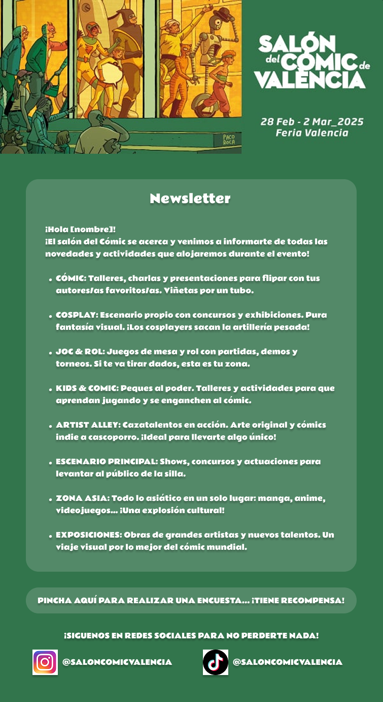

# 🎪 Proyecto de Prácticas en la Feria de Valencia

¡Bienvenido al repositorio! 👋  
En este repositorio tengo los templates de los mails y la app desarrollada en Python que se encarga de enviarlos (base de datos incluida sin datos).

## 📬 ¿Qué contiene este repositorio?

- 📨 **Templates MJML**.
- 🐍 **Aplicación en Python** para el envío automatizado de los mails.
- 🗃️ **Base de datos MySQL** incluida (sin datos).

## ⚠️ Nota
- La base de datos está vacía.  
- Los archivos de configuración están incluidos como ejemplos (`.ejemplo`) para que puedas replicarlos.

## 🛠️ ¿Qué tecnologias uso?
- 🐍 **Python**
- 🐬 **MySQL**
- 📨 **MJML / HTML**
- 🐳 **Docker**
- 🐧 **Bash**
- 🪟 **PowerShell**

## 📦 Índice del Repositorio

📄 [`.gitattributes`](./.gitattributes)  
📄 [`.gitignore`](./.gitignore)   
📄 [`README.md`](./README.md)  

📁 [`assets/`](./assets)  
- ↳ 📁 [`diagrams/`](./assets/diagrams)  
  - ↳ ↳ 📄 [`bbdd.dia`](./assets/diagrams/bbdd.dia)  
- ↳ 📁 [`images/`](./assets/images)  
  - ↳ ↳ 📁 [`2ruedas/`](./assets/images/2ruedas)  
    - ↳ ↳ ↳ 📄 [`cabecera.jpg`](./assets/images/2ruedas/cabecera.jpg)  
  - ↳ ↳ 📁 [`cevisama/`](./assets/images/cevisama)  
    - ↳ ↳ ↳ 📄 [`cabecera.jpg`](./assets/images/cevisama/cabecera.jpg)  
  - ↳ ↳ 📁 [`expojove/`](./assets/images/expojove)  
    - ↳ ↳ ↳ 📄 [`cabecera.jpg`](./assets/images/expojove/cabecera.jpg)  
  - ↳ ↳ 📁 [`salon_comic/`](./assets/images/salon_comic)  
    - ↳ ↳ ↳ 📄 [`cabecera.jpg`](./assets/images/salon_comic/cabecera.jpg)  
    - ↳ ↳ ↳ 📄 [`conceptoMail.png`](./assets/images/salon_comic/conceptoMail.png)  
    - ↳ ↳ ↳ 📄 [`FODA.png`](./assets/images/salon_comic/FODA.png)  

📁 [`docs/`](./docs)  
- ↳ 📄 [`SalonComic.md`](./docs/SalonComic.md)  

📁 [`src/`](./src)  
- ↳ 📄 [`credenciales.inf.ejemplo`](./src/credenciales.inf.ejemplo)  
- ↳ 📁 [`app/`](./src/app)  
  - ↳ ↳ 📄 [`config.py`](./src/app/config.py)  
  - ↳ ↳ 📄 [`database.py`](./src/app/database.py)  
  - ↳ ↳ 📄 [`launch.ps1`](./src/app/launch.ps1)  
  - ↳ ↳ 📄 [`launch.sh`](./src/app/launch.sh)  
  - ↳ ↳ 📄 [`mailer.py`](./src/app/mailer.py)  
  - ↳ ↳ 📄 [`__main__.py`](./src/app/__main__.py)  

- ↳ 📁 [`docker/`](./src/docker)  
  - ↳ ↳ 📄 [`.env.ejemplo`](./src/docker/.env.ejemplo)  
  - ↳ ↳ 📄 [`docker-compose.yml`](./src/docker/docker-compose.yml)  

- ↳ 📁 [`html/`](./src/html)  
  - ↳ ↳ 📄 [`SalonComic.html`](./src/html/SalonComic.html)  

- ↳ 📁 [`mjml/`](./src/mjml)  
  - ↳ ↳ 📄 [`SalonComic.mjml`](./src/mjml/SalonComic.mjml)  

- ↳ 📁 [`scripts/`](./src/scripts)  
  - ↳ ↳ 📄 [`levanta_docker.sh`](./src/scripts/levanta_docker.sh)  
  - ↳ ↳ 📄 [`setup_all.sh`](./src/scripts/setup_all.sh)  
  - ↳ ↳ 📄 [`setup_base.sh`](./src/scripts/setup_base.sh)  
  - ↳ ↳ 📄 [`setup_python_env.sh`](./src/scripts/setup_python_env.sh)  

- ↳ 📁 [`sql/`](./src/sql)  
  - ↳ ↳ 📄 [`FeriaValencia.sql`](./src/sql/FeriaValencia.sql)  

  

## 📧 Supuesto 1: Template de la Newsletter del Salón del Manga

### 🎨 Vista previa del diseño

---

*Este es el template que de la newsletter del Salón del Manga, listo para enviar.*
