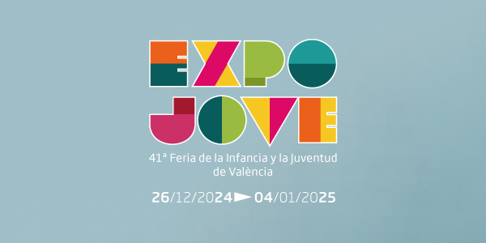

En este repositorio guardaré todos los proyectos relacionados con la fería de Valencia.

## CASOS PRÁCTICOS 

### Supuesto 1 
Creación de un boletín informativo para Salón del Cómic de València, destacando noticias y promociones especiales.  

### Supuesto 2
Cevisama debe comunicar una gran inversión realizada para atraer compradores (Visitantes) internacionales, necesitamos transmitirlo al expositor.  

### Supuesto 3
Expojove tiene que enviar una comunicación a sus expositores destacando los servicios a los que tienen acceso y como solicitarlos.  

### Supuesto 4
La feria dos ruedas sortea dos entradas para ver el GP de motociclismo de Cheste entre todos los que cumplimenten el formulario de las entradas a la feria antes del 1 de septiembre.  
