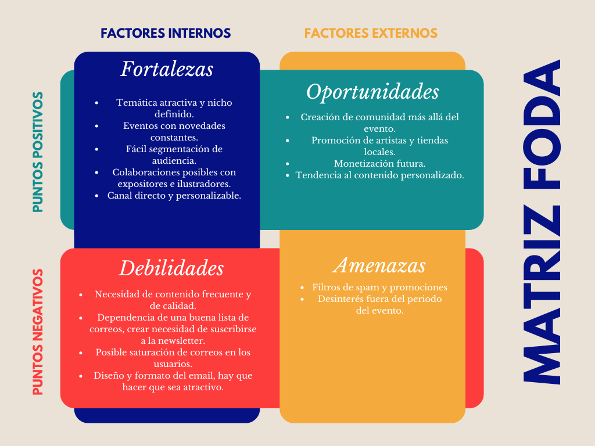

# INFORME SOBRE EL PROYECTO DEL SALÓN DEL CÓMIC 📄

## OBJETIVOS DEL PROYECTO 📌
Crear un boletín informativo sobre el Salón del Cómic de Valencia, exponiendo al público las novedades y actividades del próximo evento para captar a posibles visitantes que no estén seguros de si acudir al evento.

## ANÁLISIS Y PÚBLICO OBJETIVO 🕵️‍♂️  
El público objetivo que tiene este evento es muy amplio, prácticamente cualquier edad comprendida entre los 13 a los 65 años.  

Para ver el grueso del público y sus caracteristicas para poder adaptar a sus gustos el boletín, se enviará un primer boletín genérico dónde habrá un cuestionario para recabar información y enviarla a una base de datos.

He hecho un análisis FODA para tener una vista más general de los retos que puede tener este proyecto:  

## DISEÑO 🎨
El diseño que he creado es el siguiente:  
  
Es un diseño que usa la tipografía de la web del Salón del Cómic y el color verde usado en el cartel de esta edición para mantener coherencia.  